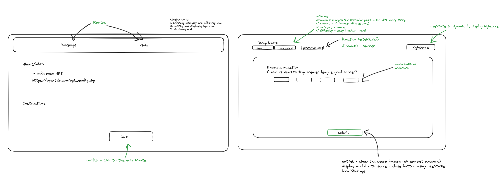
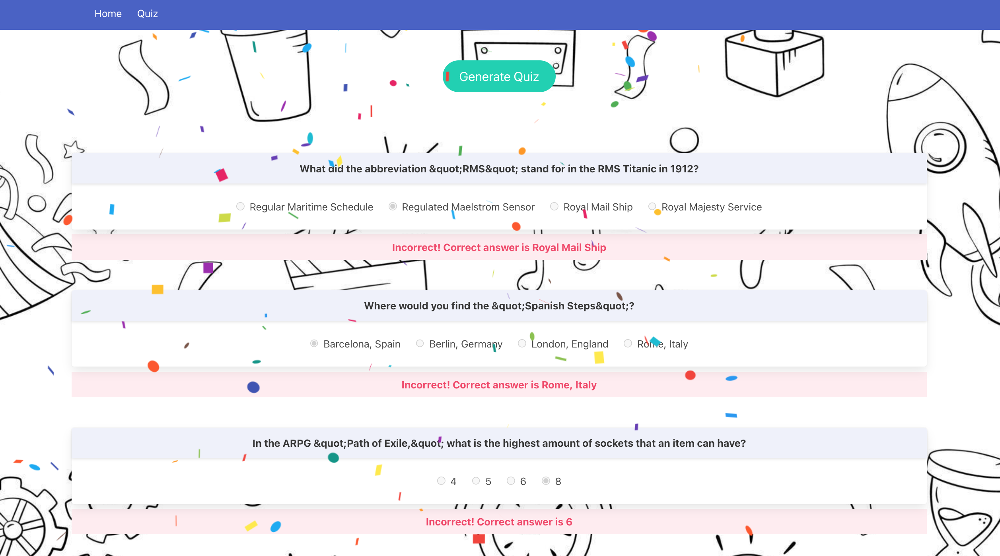

# Open Trivia Quiz Game

## Project Description

This project took place during week six of General Assembly’s Software Engineering Bootcamp. It was a 48 hour ‘Hackathon’ pair project, where we were tasked with using a public API to create an Express App using ReactJS JavaScript framework.

Have a go at the quiz here: https://catherine-liv-project-2.netlify.app/ 

I worked with my peer [Catherine Brett](https://github.com/CatherineBrett/SEB-Project-2) on this project. 

## Installation Instructions

To download the code to your local machine:
```
git clone git@github.com:livdarby/SEB-Project-2.git
```

- Navigate to the root of the project directory.
- Run npm install to install all dependencies.
- ```npm run dev``` from the termianl to start the development server.

## Technologies Used

- ReactJS
- TypeScript
- Bulma/SCSS
- Insomnia


## Brief
The brief for this project was to create a multi-page App to fetch and display data from any public API, using ReactJS.

As this was a short project, we focused on our MVP and clearly set out stretch goals to work on time-permitting. 

We were introduced to ReactJS two weeks prior to the project, so the goal here was to consolidate our learnings, especially concerning API HTTP requests, SWR method, TypeScript, ReactJS Router and components.

## Planning
We chose the [Open Trivia DB API](https://opentdb.com/api_config.php) to make a quiz app.

We started by sketching our wireframe using Excalidraw and thinking about where we would need to use useState() and Routes.




We decided to pair program for the duration of the project, taking it in turns to be the driver and navigator.


## Build/Code Process
We started by creating our Router, Navbar and two main page components (the home/about page and quiz page) as this would form the basis of our App. 

The next step was fetching the quiz questions, correct and incorrect answers from the API using an async function and useState Hook. We used an event handler on the ‘Generate Quiz’ button, which returns a spinner while the API data is being fetched.

```
async function fetchQuiz() {
   const resp = await fetch(
     "https://opentdb.com/api.php?amount=10&type=multiple"
   );
   const data = await resp.json();
   // remove quote strings
   setQuestions(data.results);
 }  
 ```

To adhere to React best practice and limit component creation, we mapped through the questions array and returned a ShowQuestions component for each element. 

Once we had this data passed through, we needed a way to insert the correct answer into the three incorrect answers. Using push wouldn’t work, since an astute player would soon figure out that the last answer was always the correct one! 

We solved this problem by using a spread operator to combine the two arrays, and then sorted the new array alphabetically. 

```
const allAnswers = [...incorrect, correct];
 console.log("All answers are: ", allAnswers);
 const shuffledAnswers = [...allAnswers].sort();
 console.log("Shuffled answers are: ", shuffledAnswers);
 ```

To update the player’s score each time an answer was selected, we used useState to update the selectedAnswer and to compare the event target with the correct answer (taken from the API array). The handleAnswerSelection function was called using onChange on each of the radio button inputs.

```
function handleAnswerSelection(e: any) {
   setSelectedAnswer(e.currentTarget.value);
   increaseNoOfAnswers();
   console.log(e.currentTarget.value);
   console.log(correct);
   if (e.currentTarget.value === correct) {
     increaseFunction();
   }
 }
 ```

The player’s score is hidden until they have answered all ten questions, at which point the ‘Reveal Score’ button is activated, which has an onClick event handler. 

```
<button 
    className="button is-link is-rounded"
    disabled={numberOfAnswers !== 10}
    onClick={revealScoreClick} >
        Reveal Score
</button>
{revealScore && (
    <p className="mt-4 p-2 has-background-link-light">
    <span className="mt-2 p-2 as-text-centered has-text-weight-bold has-text-link">
        You scored: {playerScore}!
    </span>
    </p>
```

We achieved a stretch goal, adding text underneath each question showing whether the selected answer was correct. For each incorrect answer (highlighted in red), we also revealed the correct answer for the player to review. We also used the react-confetti npm package to display once the ‘Reveal Score’ button is clicked.



## Challenges
The App UI was initially rendering incorrectly each time an answer was selected. When an answer to question one was clicked, it disabled all the radio buttons on the following questions as well. We realised that we needed to provide React with a unique key to differentiate between each individual ShowQuestions component, and used the question id to do this. We passed the id through as a prop whilst mapping through the API array, and used it as a key on each radio input.

```
<ShowQuestions
    increaseFunction={handlePlayerScoreIncrease}
    increaseNoOfAnswers={increaseAnswers}
    reveal={revealScore}
    key={element.question}
    id={i}
    question={element.question}
    correct={element.correct_answer}
    incorrect={element.incorrect_answers}
/>
```

We initially tried combining the correct and incorrect answer arrays using the push() method. However, after realising that this only returns an array length, we used the spread operator instead.
As we rendered components within components, to create a logical and clear structure to our App, we needed to pass functions, state variables, unique identifiers and API data as props in the components. This is the first time I had done this and was a great learning exercise. 

Another challenge was using Bulma for the first time. I took some time to understand the documentation but helped to streamline the layout and mobile responsiveness. 

## Wins
One of my main wins in this project was taking a simple API and using it in a relatively complex manner. 

There were lots of moving parts to get the quiz to render correctly and Catherine and I were presented with various different challenges, which we approached collaboratively and creatively. It was a fantastic first experience of pair programming.

## Key Learnings/Takeaways
This project consolidated my understanding of React and TypeScript, and I felt well equipped to approach new challenges and apply my coding fundamentals to more complex problems.

I enjoyed pair programming and learning from my peer, and gained confidence in both the driver and navigator roles.

## Bugs
The question and answer values are not being correctly decoded so all special characters are rendered as entity strings. 

We didn’t have time to solve for this problem but suggested solutions are ensuring proper JSON parsing and using Reg Exp to replace all entity strings before rendering the text.

We did not want to use dangerouslySetInnerHTML as it would make our code vulnerable to cross-site scripting attacks, which we are especially cautious of as we are fetching data from a third-party API.

## Future Improvements
We created our ‘Category’ and ‘Difficulty Level’ dropdowns, however we did not have time to make these interactive, so have commented them out in the code. This would be something I’d like to implement to provide a better user experience, altering the endpoint of the API fetch request.

We also implemented localStorage of the high score, however it is not currently being rendered on the page. I would like to update the confetti to only render if a new high score is achieved.

```
const [highScore, setHighScore] = React.useState(
   localStorage.getItem("highscore")
 );

function revealScoreClick() {
   setRevealScore(true);
   // if (Number(highScore) === 0 || Number(highScore) < playerScore) {
   //   console.log("new high score!");
   //   localStorage.setItem("highscore", playerScore);
   //   setHighScore(playerScore);
   // }
 }
 ```

Finally, I would like to calculate the player score once within the ‘Reveal Score’ event handler, rather than each time an answer is selected. This would allow the player to dynamically change their answer, instead of needing to disable the radio button after an option is selected. 
